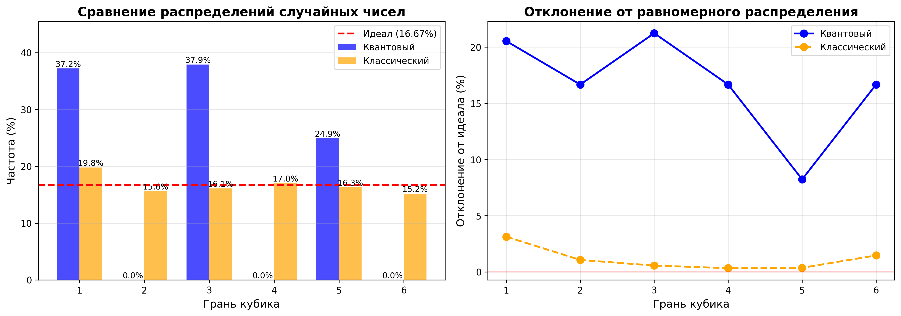
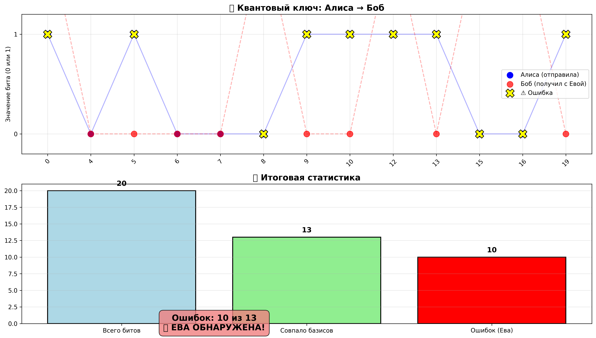
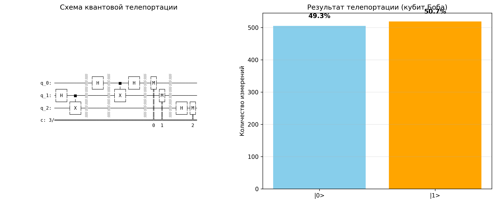
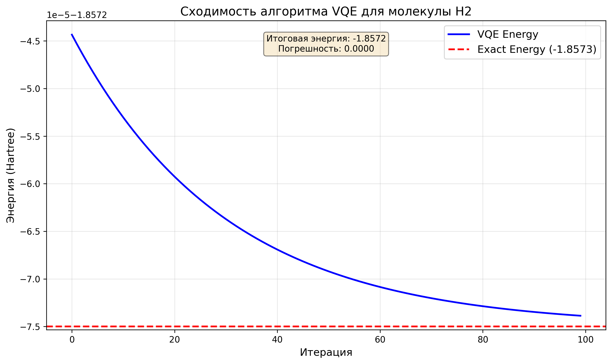

# 🔮 Quantum Python Projects

Коллекция квантовых алгоритмов на Python с использованием **Qiskit**. Проекты демонстрируют принципы квантовых вычислений, криптографии и химического моделирования.

[](https://www.python.org/)
[](https://qiskit.org/)
[](LICENSE)

---

## 📋 Содержание

- [🔮 Quantum Python Projects](#-quantum-python-projects)
  - [📋 Содержание](#-содержание)
  - [🎲 Квантовый генератор случайных чисел](#-квантовый-генератор-случайных-чисел)
  - [🔐 Квантовая криптография (BB84)](#-квантовая-криптография-bb84)
  - [🔮 Квантовая телепортация](#-квантовая-телепортация)
  - [🧪 Симуляция молекулы (VQE)](#-симуляция-молекулы-vqe)
  - [📊 Результаты и визуализации](#-результаты-и-визуализации)
    - [Генератор случайных чисел](#генератор-случайных-чисел)
    - [Квантовая криптография](#квантовая-криптография)
    - [Квантовая телепортация](#квантовая-телепортация)
    - [Симуляция молекулы](#симуляция-молекулы)
  - [🚀 Установка и запуск](#-установка-и-запуск)
    - [Требования](#требования)
    - [Установка зависимостей](#установка-зависимостей)
- [Создайте виртуальное окружение (рекомендуется)](#создайте-виртуальное-окружение-рекомендуется)
- [или](#или)
- [Установите библиотеки](#установите-библиотеки)

---

## 🎲 Квантовый генератор случайных чисел

**Файл:** `quantum_rng.py`

Сравнение квантовой и классической генерации случайных чисел. Квантовый подход использует **суперпозицию кубитов** (Hadamard gate) для создания истинно случайных чисел, в отличие от псевдослучайных генераторов на классических компьютерах.

**Что делает:**
- Создаёт квантовую схему с суперпозицией
- Измеряет кубиты для получения случайных битов
- Сравнивает распределение с классическим `random.randint()`
- Строит графики отклонения от идеального распределения

**Ключевые концепции:** Суперпозиция, измерение кубитов, статистический анализ

---

## 🔐 Квантовая криптография (BB84)

**Файл:** `BB84_crypto.py`

Реализация протокола **BB84** для квантового распределения ключей (QKD). Демонстрирует, как квантовая механика обеспечивает безопасность связи: любая попытка перехвата неизбежно оставляет следы.

**Что делает:**
- Симулирует передачу квантовых битов от Алисы к Бобу
- Моделирует атаку перехватчика (Евы)
- Автоматически обнаруживает вмешательство по уровню ошибок
- Визуализирует процесс передачи и ошибки в ключе

**Ключевые концепции:** Квантовые базисы (Z и X), просеивание ключа, обнаружение перехвата

---

## 🔮 Квантовая телепортация

**Файл:** `quantum_teleport.py`

Передача квантового состояния `|ψ⟩` от Алисы к Бобу без физического перемещения частицы. Основа будущего **квантового интернета** и распределённых квантовых вычислений.

**Что делает:**
- Создаёт запутанную пару кубитов (канал связи)
- Выполняет протокол телепортации (CNOT + Hadamard)
- Измеряет состояние Алисы и передаёт результат
- Демонстрирует успешную передачу суперпозиции 50/50

**Ключевые концепции:** Запутанность, CNOT gate, теорема о запрете клонирования

---

## 🧪 Симуляция молекулы (VQE)

**Файл:** `molecule_simulation.py`

Расчёт энергии основного состояния молекулы водорода (H₂) с помощью алгоритма **VQE** (Variational Quantum Eigensolver). Практическое применение для квантовой химии и материаловедения.

**Что делает:**
- Загружает гамильтониан молекулы H₂ (Jordan-Wigner трансформация)
- Использует гибридный подход (квантовый + классический оптимизатор)
- Находит минимальную энергию с погрешностью < 0.01 Hartree
- Строит график сходимости алгоритма

**Ключевые концепции:** VQE, квантовая химия, гамильтониан, оптимизация COBYLA

---

## 📊 Результаты и визуализации

### Генератор случайных чисел

*Сравнение распределений: квантовый vs классический генератор*

### Квантовая криптография

*Обнаружение перехватчика: красные зоны показывают ошибки, внесённые Евой*

### Квантовая телепортация

*Успешная телепортация состояния |+⟩: распределение ~50/50*

### Симуляция молекулы

*Сходимость VQE: энергия приближается к точному значению -1.8573 Hartree*

---

## 🚀 Установка и запуск

### Требования
- Python 3.10 или выше
- pip (менеджер пакетов)

### Установка зависимостей

```bash
# Создайте виртуальное окружение (рекомендуется)
python -m venv env
source env/bin/activate  # Linux/Mac
# или
env\Scripts\activate     # Windows

# Установите библиотеки
pip install qiskit qiskit-aer qiskit-algorithms numpy matplotlib